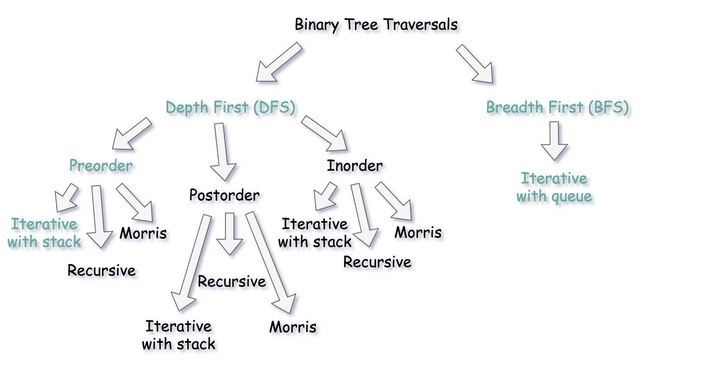
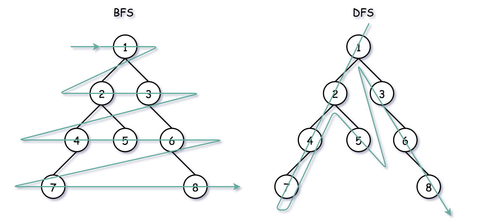
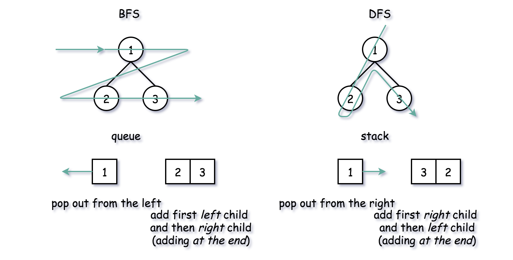

# Tree

Definition
A Tree is:
- empty, or
- a node with:
- a key, and
- a list of child trees

## Trees

- Syntax Tree for a Sentence (I ate the cake)
- Syntax Tree for an Expression (2sin(3z - 7))
- Geography Hierarchy, Animal Kingdom
- Abstract Syntax Tree for Code
  `while x < 0:
  x = x + 2
  foo(x)`
- Binary Search Tree
- Simple Tree
    - Empty tree:
    - Tree with one node: Fred
    - Tree with two nodes: Fred - Sally

## Walking a Tree
visit the nodes of a tree in a particular order.
- Depth-first: we completely traverse one sub-tree before
  exploring a sibling sub-tree
- Breadth-first: we traverse all nodes at one level
  before progressing to the next level

#### Breadth-first traversal:
- LevelTraversal(tree)
  `if tree == nil
  return;
  Queue q;
  q.Enqueue(tree)
  while not q.Empty():
  node <- q.Dequeue()
  Print(node)
  if node.left != nil:
  q.Enqueue(node.left)
  if node.right != nil:
  q.Enqueue(node.right)`

### Walking a binary search tree
- InOrderTraversal(tree)
  `if tree == nil:
  return;
  InOrderTraversal(tree.left)
  Print(tree.key)
  InOrderTraversal(tree.right)`

- PreOrderTraversal(tree)
  `if tree == nil
  return;
  Print(tree.key)
  PreOrderTraversal(tree.left)
  PreOrderTraversal(tree.right)`

- PostOrderTraversal(tree)
  `if tree == nil
  return;
  PostOrderTraversal(tree.left)
  PostOrderTraversal(tree.right)
  Print(tree.key)` 

## Trees

- Binary tree is a tree where each node has up to 2 child nodes.
- Binary search tree (ordered binary tree) is a tree where left child nodes
  contain only values less than the parent node,
  and where right child nodes contain only values more than the parent node.
- The depth of a node is the number of edges from the root to the node
- The height of a node is the number of edges from the node to the deepest leaf
- The height of a tree is a height of the root
- A full binary tree is a binary tree in which each node has exactly zero or two child nodes
- A complete binary tree is a binary tree, which is completely filled, with the possible exception
  of the bottom level, which is filled from left to right

## Traverse
To traverse means to visit the vertices in some systematic order.

### Traversal methods for trees
- preorder: visit each node before its children
- inorder (for binary trees only): visit left subtree, node, right subtree
- postorder: visit each node after its children
