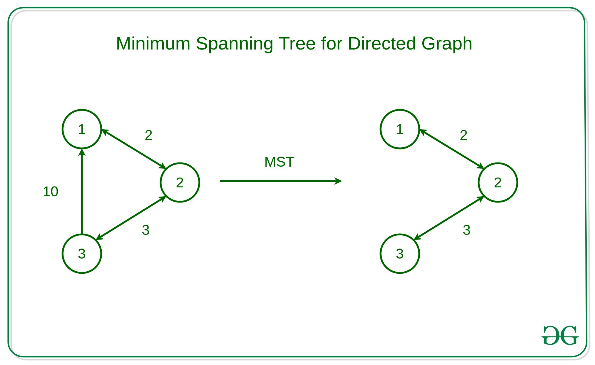

Minimum Spanning Tree (MST)

- Kruskal's minimum spanning tree algorithm
- Prim's minimum spanning tree algorithm
- Boruvka's minimum spanning tree algorithm

- A minimum spanning tree (MST) is defined as a spanning tree that has the minimum weight among all the possible spanning trees

- A spanning tree is defined as a tree-like subgraph of a connected, undirected graph that includes all the vertices of the graph. Or, to say in Layman’s words, it is a subset of the edges of the graph that forms a tree (acyclic) where every node of the graph is a part of the tree.

- 

Properties of a Spanning Tree:
The spanning tree holds the below-mentioned principles:

The number of vertices (V) in the graph and the spanning tree is the same.
There is a fixed number of edges in the spanning tree which is equal to one less than the total number of vertices ( E = V-1 ).
The spanning tree should not be disconnected, as in there should only be a single source of component, not more than that.
The spanning tree should be acyclic, which means there would not be any cycle in the tree.
The total cost (or weight) of the spanning tree is defined as the sum of the edge weights of all the edges of the spanning tree.
There can be many possible spanning trees for a graph.

## Kruskal's algorithm
This is one of the popular algorithms for finding the minimum spanning tree from a connected, undirected graph. This is a greedy algorithm. The algorithm workflow is as below:

First, it sorts all the edges of the graph by their weights,
Then starts the iterations of finding the spanning tree.
At each iteration, the algorithm adds the next lowest-weight edge one by one, such that the edges picked until now does not form a cycle.
This algorithm can be implemented efficiently using a DSU ( Disjoint-Set ) data structure to keep track of the connected components of the graph. This is used in a variety of practical applications such as network design, clustering, and data analysis.

## Prim's algorithm
Prim’s Minimum Spanning Tree Algorithm:
This is also a greedy algorithm. This algorithm has the following workflow:

It starts by selecting an arbitrary vertex and then adding it to the MST.
Then, it repeatedly checks for the minimum edge weight that connects one vertex of MST to another vertex that is not yet in the MST.
This process is continued until all the vertices are included in the MST. 

To efficiently select the minimum weight edge for each iteration, this algorithm uses priority_queue to store the vertices sorted by their minimum edge weight currently. It also simultaneously keeps track of the MST using an array or other data structure suitable considering the data type it is storing.

## Boruvka’s Minimum Spanning Tree Algorithm:
This is also a graph traversal algorithm used to find the minimum spanning tree of a connected, undirected graph. This is one of the oldest algorithms. The algorithm works by iteratively building the minimum spanning tree, starting with each vertex in the graph as its own tree. In each iteration, the algorithm finds the cheapest edge that connects a tree to another tree, and adds that edge to the minimum spanning tree. This is almost similar to the Prim’s algorithm for finding the minimum spanning tree. The algorithm has the following workflow:

Initialize a forest of trees, with each vertex in the graph as its own tree.
For each tree in the forest:
Find the cheapest edge that connects it to another tree. Add these edges to the minimum spanning tree.
Update the forest by merging the trees connected by the added edges.
Repeat the above steps until the forest contains only one tree, which is the minimum spanning tree.
